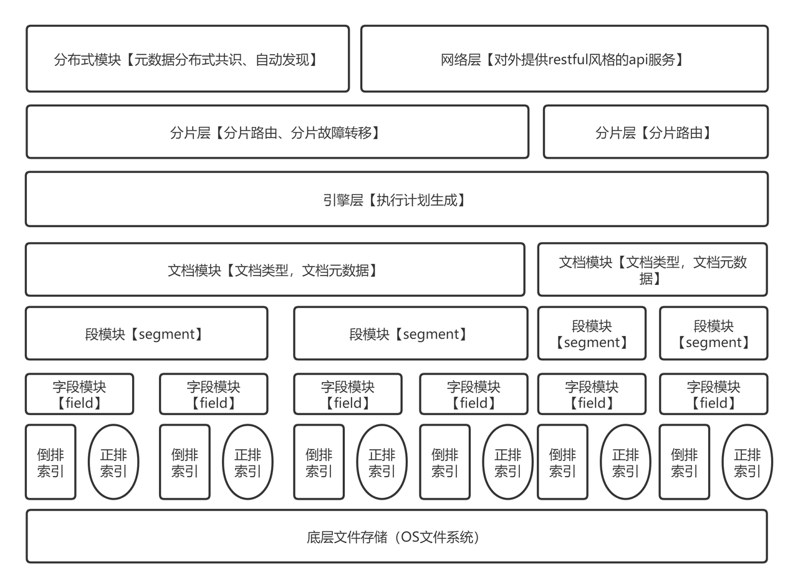
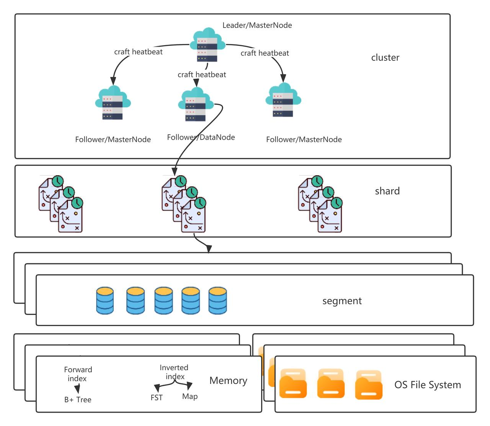

项目 **演示视频** 和 **详细设计方案** 请看[GoDance分布式搜索引擎汇总篇](https://h2fejdkch0.feishu.cn/docx/doxcnm1pp7Cfc7fLSJbU3y0zrld#doxcnmI6csEq066EMaWDwZ1E474)

GoDance是一款用go语言编写的分布式搜索引擎，同时也是一款分布式文档数据库。支持分布式搜索以及分布式存储功能，对外提供restful Api接口来操作GoDance。

GoDance整体采用主从架构，实现了Raft算法来保证元数据的一致，并有一系列机制比如tranlog、分片存储、分片迁移、故障转移等来保证集群的高可用和高拓展性；在路由方面，根据索引内存负载率和机器配置会优先路由效率高的分片节点，同时使用了rpcx来进行rpc调用；在搜索方面，实现了TF-IDF等搜索算法，并利用其实现了相关度搜索；在存储方面，利用了段的思想来提升搜索和插入的性能，同时支持正排索引（B+树）和倒排索引（BST和MAP）来提升搜索能力，并自己实现了相应的数据结构和Linux系统上的持久化机制（MMAP）。

